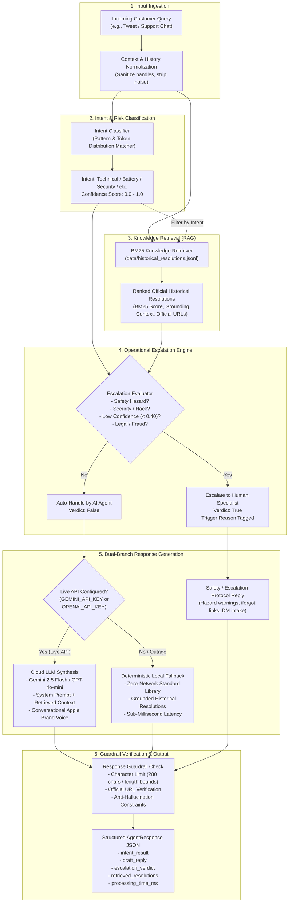

# System Architecture & Technical Design

This document details the architectural topology, pipeline flow, and operational mechanics of the Hiver AI Customer Support Agent.

---

## 1. High-Level Architecture Overview

The system is designed with a **Dual-Mode Operational Pipeline**:

1. **Live Cloud LLM Mode (Google Gemini / OpenAI GPT-4o-mini)**: When an API key (`GEMINI_API_KEY` or `OPENAI_API_KEY`) is present in `.env`, the agent dynamically injects retrieved knowledge into the LLM system prompt, generating contextually nuanced, conversational, and policy-compliant responses in brand voice.
2. **Offline Local Deterministic Fallback Mode (Pure Python Standard Library)**: When running without network connectivity or API keys (e.g., automated CI/CD runs, unit tests, fast benchmarks, or during upstream API outages), the agent falls back instantly to a deterministic local template and resolution engine in under 1 millisecond.

Both modes share the same **Intent Classification Engine**, **BM25 Historical Knowledge Retriever**, and **Operational Escalation Guardrails**.

---

## 2. End-to-End Workflow Diagram



---

## 3. Dual-Mode Operational Mechanics

### Mode A: Live Cloud LLM API (Gemini & ChatGPT)

When an API key is detected in `.env`, the system activates the live generation branch via `src/llm_client.py`:

* **Provider Priority**:
  * If `GEMINI_API_KEY` is set, `Google Gemini 2.5 Flash` (`models/gemini-2.5-flash`) is selected by default for speed, large reasoning capacity, and zero-cost tier access.
  * If `OPENAI_API_KEY` is set, `OpenAI GPT-4o-mini` (`gpt-4o-mini`) is selected.
* **Retrieval-Augmented Prompting (RAG)**:
  * The top historical resolutions retrieved by the BM25 engine are injected into the system instructions under `[Retrieved Apple Support Knowledge]`.
  * The system instructions strictly instruct the model to adhere to official Apple policies, quote authentic URLs (`apple.com`, `iforgot.apple.com`, `apple.co`), and maintain a calm, empathetic, and professional tone.
* **Multi-Turn Context**:
  * The last 6 conversation turns are formatted and transmitted to maintain dialogue continuity across user clarifications.
* **Resilient Failover**:
  * All HTTP requests use standard library `urllib.request` with an 8-second timeout.
  * If the network drops, rate limits are hit, or an HTTP error occurs, the client fails silently to Mode B without raising exceptions or breaking user interaction.

### Mode B: Offline Local Deterministic RAG Fallback

When no API keys are provided or when the upstream API is unreachable:

* **Zero External Dependencies**: Operates entirely on Python 3 standard library modules (`json`, `re`, `math`, `time`).
* **Sub-Millisecond Execution**: Processes classification, retrieval, and synthesis in approximately `0.5 ms` per request.
* **Guaranteed Grounding**: Pulls verified historical resolutions directly from the curated corpus (`data/historical_resolutions.jsonl`), appending verified official documentation links.
* **Deterministic Safety**: Always produces verified escalation copy for high-risk categories (battery swelling, active account compromise, financial disputes).

---

## 4. Module Directory & Responsibilities

| Module | File Path | Primary Function |
| :--- | :--- | :--- |
| **Data Contracts** | `src/models.py` | Defines immutable data structures: `CustomerTweet`, `IntentResult`, `EscalationVerdict`, `HistoricalResolution`, and `AgentResponse`. |
| **Intent Classifier** | `src/classifier.py` | Multi-class intent classifier mapping inputs to 8 distinct categories (`BATTERY_HEALTH`, `TECHNICAL_GLITCH`, `ACCOUNT_ACCESS`, `DEVICE_COMPATIBILITY`, `SHIPPING_ORDER`, `BILLING_PAYMENT`, `FEATURE_REQUEST`, `PHYSICAL_DAMAGE`). |
| **BM25 Retriever** | `src/retriever.py` | In-process Okapi BM25 ranking algorithm with intent filtering, indexing 150+ verified brand resolutions without external vector database dependencies. |
| **Escalation Engine** | `src/escalation.py` | Multi-stage safety guardrail evaluating physical hazards, security breaches, low retrieval relevance (< 0.40), and compliance risks. |
| **Unified LLM Client** | `src/llm_client.py` | Multi-provider client supporting Gemini 2.5 Flash and OpenAI GPT-4o-mini via native HTTP with automatic fallback. |
| **Agent Orchestrator** | `src/agent.py` | End-to-end coordinator chaining classification, retrieval, escalation decisions, and dual-mode reply synthesis. |
| **Evaluation Suite** | `src/evaluator.py` | Computes Intent Macro F1, Escalation F1, Precision, Recall, False-Auto Rate (FAR), and ROUGE-L across test datasets. |
| **LLM Judge** | `src/judge.py` | 4-dimensional evaluation rubric scoring Accuracy, Empathy, Completeness, and Groundedness on a 1.0 to 5.0 scale. |
| **Human Calibration** | `src/human_study.py` | Validates inter-rater reliability between human annotations and the automated judge using Cohen's Kappa (kappa) and Pearson correlation (r). |

---

## 5. Configuration & Environment Setup

### Environment Variables

Configure API keys in `.env` located at the repository root:

```ini
# Google Gemini 2.5 Flash API Key (Recommended)
GEMINI_API_KEY=AIzaSy...

# Or OpenAI API Key
OPENAI_API_KEY=sk-...
```

If neither key is specified, the system automatically runs in Mode B (Offline Local Fallback).

### Testing the Configuration

1. **Interactive Console**:
   ```bash
   python3 interactive.py
   ```
   The header indicates the active generation mode (`Live Gemini LLM API`, `Live OpenAI API`, or `Offline Local RAG Fallback`).

2. **Automated Evaluation Harness**:
   ```bash
   python3 run_eval.py
   ```
   Executes the full 200-sample golden benchmark, comparing baseline models against the proposed agent.

3. **Unit Test Suite**:
   ```bash
   python3 -m unittest discover -s tests -v
   ```
   Validates intent classification accuracy, retrieval scoring, escalation guardrails, and length limits.
